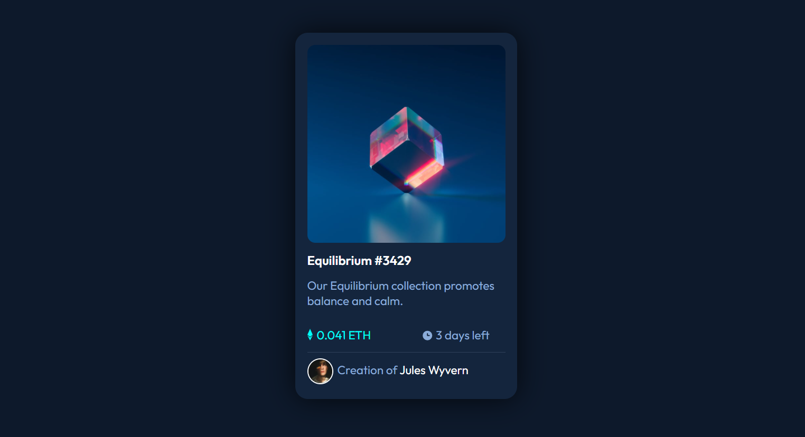
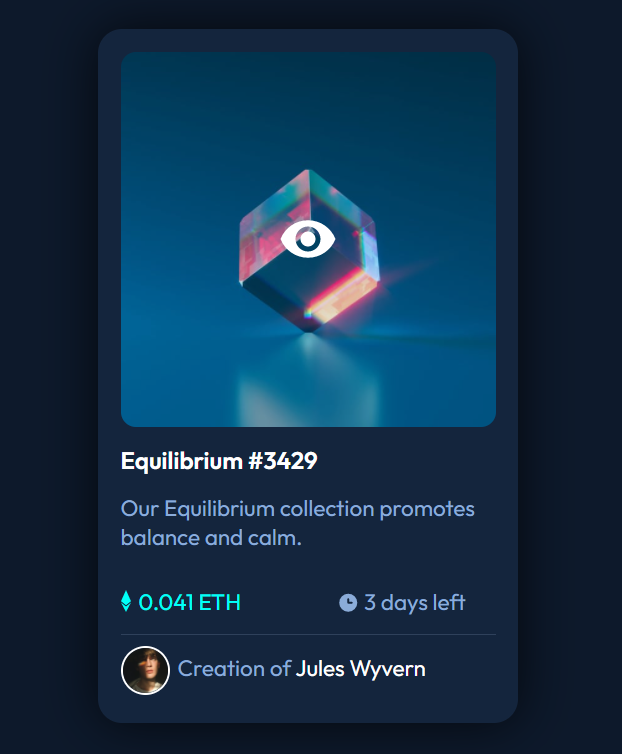

# Frontend Mentor - NFT preview card component solution

This is a solution to the [NFT preview card component challenge on Frontend Mentor](https://www.frontendmentor.io/challenges/nft-preview-card-component-SbdUL_w0U). Frontend Mentor challenges help you improve your coding skills by building realistic projects. 

### The challenge

Users should be able to:

- View the optimal layout depending on their device's screen size
- See hover states for interactive elements

### Screenshot

### Links

- Solution URL: [https://www.frontendmentor.io/solutions/html-css-flexbox-2VrbIP7DJ](https://www.frontendmentor.io/solutions/html-css-flexbox-2VrbIP7DJ)
- Live Site URL: [https://tarunsahnan.github.io/NFT-preview-card-component/](https://tarunsahnan.github.io/NFT-preview-card-component/)

### Built with

- Semantic HTML5 markup
- CSS custom properties
- Flexbox
